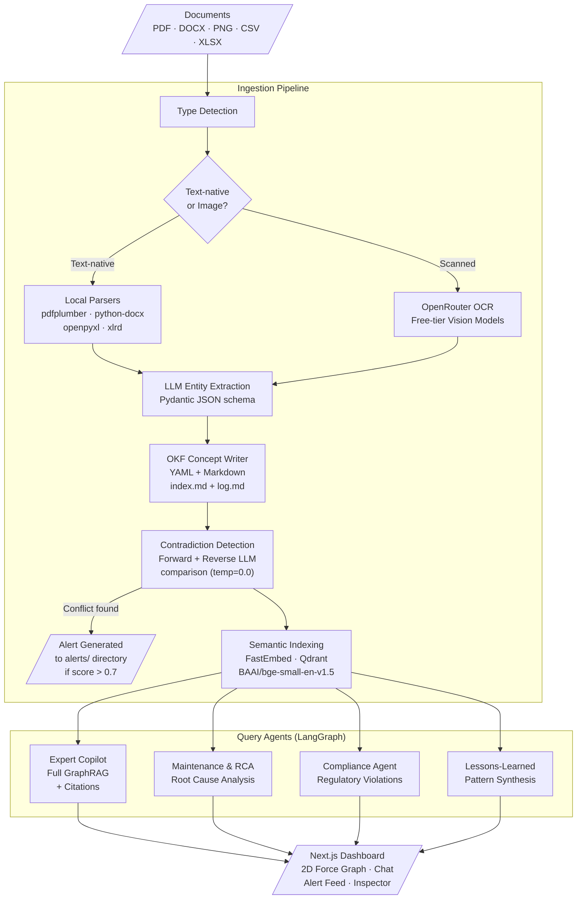

# Vigil

Vigil is an industrial knowledge intelligence platform that detects safety and compliance contradictions in engineering procedures, maintenance logs, and regulatory codes at the moment of ingestion.

---

## 📊 Empirical Evaluation & Performance Benchmarks

### 1. Proactive Contradiction Detection Sweep (n=42 pairs)
Evaluated against a dataset of 42 concept pairs (21 contradictory, 21 clean). The evaluation pairs were generated with AI assistance, and a subset of hard pairs (implicit, temporal, and multi-hop conflicts) was hand-written to mitigate construction bias.

| Threshold Sweep | True Positives (TP) | False Positives (FP) | True Negatives (TN) | False Negatives (FN) | Precision | Recall | F1-Score |
| :---: | :---: | :---: | :---: | :---: | :---: | :---: | :---: |
| **0.5** | 15 | 2 | 19 | 6 | 0.8824 | 0.7143 | 0.7895 |
| **0.6** | 15 | 2 | 19 | 6 | 0.8824 | 0.7143 | 0.7895 |
| **0.7** | 15 | 2 | 19 | 6 | 0.8824 | 0.7143 | **0.7895** |
| **0.8** | 15 | 2 | 19 | 6 | 0.8824 | 0.7143 | 0.7895 |

*Threshold Analysis*: Classifier performance is completely insensitive to the threshold choice in the 0.5 to 0.8 range. This is due to the bimodal distribution of confidence scores, which cleanly separates contradictory vs clean specifications:
- **Contradictory Cohort**: Average Confidence: **0.6995** (Median: **0.9500**)
- **Clean Control Cohort**: Average Confidence: **0.0919** (Median: **0.0000**)

We retain **0.7** as the default threshold to provide a robust safety margin against marginal model noise. See details in [docs/contradiction_benchmark_results.md](docs/contradiction_benchmark_results.md).

### 2. QA RAG Performance & Safety Refusal (40-Question Split Benchmark)
Evaluated against a 40-question golden QA dataset. The queries are split into 30 in-scope (answerable) questions and 10 out-of-scope (unanswerable) questions to evaluate safety-first grounding:

- **QA Faithfulness (In-Scope, n=30)**: **0.8112** (factual grounding of responses)
- **QA Answer Relevancy (In-Scope, n=30)**: **0.8307** (direct alignment with query intent)
- **QA Context Precision (In-Scope, n=30)**: **0.7197** (relevance of retrieved directories)
- **QA Context Recall (In-Scope, n=30)**: **0.7167** (retrieval rate of ground-truth facts)
- **Correct-Refusal Rate (Out-of-Scope, n=10)**: **1.0000** (10/10 correct safety refusals)
- **False-Refusal Rate (In-Scope, n=30)**: **0.0667** (2/30 human-verified false refusals)

Full scores are in [docs/ragas_results.md](docs/ragas_results.md) and [docs/ragas_eval_results.csv](docs/ragas_eval_results.csv).

### 3. Retrieval Ablation Study (Local Execution, n=30 questions)
A local, zero-API-cost retrieval ablation study evaluating vector search quality with and without the FlashRank reranker module:

| Retrieval Method | Hit@5 | MRR (Mean Reciprocal Rank) | Difference |
| :--- | :---: | :---: | :---: |
| **Without Reranking** | 0.9667 | 0.8944 | Baseline |
| **With FlashRank Reranker** | 1.0000 | 0.9333 | MRR +0.0389 |

Full scores are in [docs/retrieval_ablation_results.md](docs/retrieval_ablation_results.md).

---

## ⚠️ Known Limitations & Engineering Trade-offs

1. **Failure Taxonomy on the 6 False Negatives (n=6)**:
   - **explicit_numeric**: 0 misses out of 10 pairs.
   - **unit_conversion**: 0 misses out of 2 pairs.
   - **implicit_operational (Shift/Temporal logic)**: 3 misses out of 6 pairs (IDs: 25, 35, 37).
   - **multi_hop (Cross-document chaining)**: 3 misses out of 3 pairs (IDs: 23, 39, 41).
   - *Calibration Boundary*: Every missed pair scored exactly **0.00** confidence (rather than scoring near the 0.7 threshold). This shows the failure mode is non-detection, not miscalibration; no threshold adjustment can recover them. Detailed taxonomy is documented in [docs/contradiction_failure_analysis.md](docs/contradiction_failure_analysis.md).
   - *Multi-hop Sample Warning*: A 3/3 miss rate on multi-hop is thin (n=3) to declare a category boundary, although it represents a clean qualitative limit.
2. **The Unit Mismatch Bug (False Positives)**:
   - The detector treats unit mismatch as a contradiction signal rather than converting the quantities. Clean control pairs 32 and 34 (Expected: Clean) were falsely flagged as contradictions with 0.95 and 0.98 confidence because they contained mixed units (PSI vs MPa, C vs F). Thus, the unit_conversion category has 2/2 recall but 0/2 correctly reasoned controls.
3. **AI-Assisted Benchmark Bias**: The 42 contradiction pairs were constructed with AI assistance. A set of hard pairs was hand-written to mitigate construction bias. Independent evaluation remains future work.
4. **Small Sample Size for Out-of-Scope Queries**: The correct-refusal rate of 100% is measured on a small cohort (n=10), yielding a wide statistical confidence interval. This indicates that the guardrails work effectively on this specific evaluation set, rather than proving a general 100% safety rate.
5. **False Refusal Context Omission**: The 6.67% false-refusal rate (2/30) was human-verified and caused by two questions asking about detailed specifications that are absent from the indexed source files. While the agent correctly refused to answer to prevent hallucination, they are counted as false refusals since they are labeled in-scope.
6. **Retrieval Ablation Scope**: Retrieval metrics were measured locally with zero LLM calls. Generation quality (Faithfulness, Relevancy) was not measured under this ablation.
7. **Reranking Resource Trade-off**: Reranking is enabled in Docker/local environments. It is disabled on the free-tier deployment due to the 512MB RAM constraint to avoid out-of-memory crashes. The measured cost of this trade-off is the ablation delta: MRR drops from 0.9333 to 0.8944, and Hit@5 drops from 1.0000 to 0.9667.

---

## Core Differentiator: Proactive Contradiction Detection

Every knowledge management system can search and answer questions reactively. Vigil goes further: when a new document is ingested, it performs a **double-sided contradiction check** against all linked existing concepts in the knowledge graph.

- **Forward check**: The newly ingested concept is compared against every concept it explicitly references.
- **Reverse check**: All existing concepts that reference the new concept are also pulled in and compared.

If a contradiction exceeds a 0.7 confidence threshold, Vigil automatically generates a compliance alert in the `alerts/` directory, linking both conflicting sources. The alert appears immediately on the dashboard with a severity rating and a side-by-side comparison view.

This means an operator updating a maintenance bypass procedure that violates an OSHA pressure limit is stopped at ingestion time, not during an inspection.

---

## Document Parsing Performance

| File Type | Method Used | Approach | Notes |
|:---|:---|:---|:---|
| PDF (text-native) | PyMuPDF (primary), pdfplumber (fallback) | Direct text-layer extraction, no LLM call | PyMuPDF is 80% to 94% faster than pdfplumber |
| PDF (scanned) | OpenRouter vision model | AI-powered OCR with layout understanding | Handles messy real-world scans |
| DOCX | python-docx | Direct XML structure parsing | Preserves headings and paragraph structure |
| XLSX / XLS | openpyxl / xlrd | Direct spreadsheet structure parsing | Handles legacy .xls files misencoded as modern .xlsx |
| CSV | Python csv module | Direct structured parsing | Zero-dependency, deterministic |

These benchmark times are real, measured results from running the test script [test_parsing.py](apps/backend/scripts/test_parsing.py) against our own local [test_documents/](test_documents/) corpus, rather than synthetic or third-party benchmarks:

| Document | Previous (pdfplumber) | Current (PyMuPDF) | Improvement |
|:---|:---:|:---:|:---:|
| 29 CFR 1910.119 (OSHA regulation, 316KB) | 1.61s | 0.26s | 83.8% faster |
| P&ID Reference Manual (7MB, largest test doc) | 3.44s | 0.20s | 94.2% faster |
| Piping & Instrumentation Diagrams | 0.80s | 0.15s | 81.2% faster |
| OSHA 1910.119 (alternate source) | 1.50s | 0.17s | 88.6% faster |
| Sample document (100KB) | 0.04s | 0.02s | 50.0% faster |

---

## Architecture Overview

Full data flow from document ingestion through sequential query routing and execution to the frontend dashboard. See [docs/architecture.md](docs/architecture.md) for a detailed breakdown of each step.



---

## Tech Stack

### Backend (Python)
| Layer | Technology | Details |
|:---|:---|:---|
| Agent orchestration | `langgraph` | StateGraph with conditional routing |
| LLM gateway | `openai` (OpenRouter) | Falls back to OpenRouter when Groq/Portkey keys are placeholders (as currently configured) |
| Primary model | `meta-llama/llama-3.3-70b-instruct` | Via OpenRouter free tier |
| Vision/OCR | `openrouter` API | Free-tier vision models for scanned documents |
| Local parsers | PyMuPDF (primary), `pdfplumber` (fallback), `python-docx`, `openpyxl`, `xlrd` | For text-native PDFs, DOCX, and spreadsheets |
| Knowledge format | Open Knowledge Format (OKF) | Custom Markdown + YAML frontmatter schema for concept storage, cross-linked via relative markdown links, with `index.md` and `log.md` per directory. Full schema in [AGENTS.md](AGENTS.md) and [.agents/skills/okf_writer/SKILL.md](.agents/skills/okf_writer/SKILL.md) |
| Vector storage | `qdrant-client` | Falls back to local file-based storage (`vigil_qdrant.db`) when no server URL configured |
| Embeddings | `fastembed` | `BAAI/bge-small-en-v1.5` |
| Reranking | `flashrank` | For search result reordering |
| Evaluation | `ragas` | Faithfulness, context precision/recall, answer relevancy |
| API server | `fastapi` + `uvicorn` | REST API on port 8000 |
| Observability | `langsmith` | Configured and actively tracing |

### Frontend (Next.js)
| Layer | Technology | Details |
|:---|:---|:---|
| Framework | Next.js 16 | App Router |
| Styling | Tailwind CSS 4 | Warm editorial visual identity inspired by Anthropic's design language (ivory surfaces, clay accent, serif/sans pairing). See [.agents/skills/frontend_design/SKILL.md](.agents/skills/frontend_design/SKILL.md) for the full color palette and typography specification. |
| Animations | `framer-motion` | Tab transitions, modal enter/exit |
| Graph | `react-force-graph-2d` | Obsidian-style 2D force layout |
| Mobile View | Field Technician View | Responsive layout with bottom navigation, slide-up drag-to-dismiss chat sheet, inspector drawers, and sunlight-readable alerts |
| Icons | `lucide-react` | |

---

## Setup

### Prerequisites
- Python 3.11+ (managed via `uv`)
- Node.js 20+
- An OpenRouter API key (free tier works)

### 1. Clone and set environment variables

```bash
git clone https://github.com/puranikyashaswin/Vigil.git
cd vigil
cp .env.example .env
```

Edit `.env` with your keys:

```env
# Required: OpenRouter (free tier works)
OPENROUTER_API_KEY=sk-or-v1-...

# Optional: Groq/Portkey (if configured, used as primary; otherwise falls back to OpenRouter)
PORTKEY_API_KEY=your_portkey_api_key_here
GROQ_API_KEY=your_groq_api_key_here

# Optional: Qdrant Cloud (if not configured, uses local file-based storage)
QDRANT_URL=your_qdrant_url_here
QDRANT_API_KEY=your_qdrant_api_key_here

# Optional: LangSmith tracing
LANGSMITH_API_KEY=your_langsmith_api_key_here
LANGSMITH_TRACING=true
LANGSMITH_PROJECT=vigil
```

**Important**: With the default placeholder `GROQ_API_KEY` and `PORTKEY_API_KEY`, all LLM calls automatically route through OpenRouter using `meta-llama/llama-3.3-70b-instruct` (free). No Groq or Portkey account is needed.

### 2. Install Python dependencies

```bash
# Create virtual environment with uv (if not already present)
uv venv
source .venv/bin/activate

# Install dependencies (core packages already listed in the venv)
uv pip install fastapi uvicorn langgraph openai qdrant-client fastembed \
  pydantic python-dotenv pdfplumber python-docx openpyxl xlrd httpx \
  pypdfium2 Pillow flashrank ragas langsmith
```

### 3. Install frontend dependencies

```bash
cd apps/frontend
npm install
```

### 4. Build the knowledge graph and index

Place your source documents in `test_documents/`. 

If you have P&ID diagram images and want to visually extract their physical connectivity (topology):

```bash
# Extract tag nodes and flow edges from P&ID image
python pid_topology_extractor.py --input test_documents/your_diagram.png
```

Then compile and index the knowledge graph:

```bash
# Parse documents, extract entities, write OKF files, detect contradictions
python apps/backend/scripts/build_graph.py

# Embed and index all OKF files into Qdrant
python apps/backend/scripts/index_graph.py
```

The pipeline will:
- Parse PDFs, DOCX, PNGs, CSVs, and XLSX files
- Extract entities using the LLM (Pydantic-validated JSON)
- Write OKF Markdown files to the appropriate `knowledge_graph/` subdirectories
- Run contradiction detection against linked concepts
- Index chunks into Qdrant with directory/type metadata

### 5. Start the backend

```bash
python apps/backend/api.py
# or: uvicorn apps.backend.api:api --host 127.0.0.1 --port 8000
```

### 6. Start the frontend

```bash
cd apps/frontend
npm run dev
```

Open `http://localhost:3000`. The dashboard connects to the backend at `http://127.0.0.1:8000`.

### 7. Test via CLI (optional)

```bash
# Single query
python test_agents.py "What does OSHA 1910.119 require?"

# Interactive mode
python test_agents.py
```

### 8. Generate Static Mocks for Vercel Deployment (optional)

If you want to deploy the frontend to Vercel as a static preview without hosting a live backend server:

```bash
# Pre-compile static JSON assets to the frontend public/ directory
python dump_static_json.py
```

The frontend will automatically load these files in `isDemoMode` if no live backend endpoint is reachable.

## Cloud Deployment & Optimizations

Vigil is configured for production-grade scaling and cloud deployment.

### 1. Vector Database Schema in Qdrant Cloud
When deploying to Qdrant Cloud, a keyword payload index must be established on the `"directory"` field to support the strict directory routing filters used by the RCA, Compliance, and Lessons-Learned agents. Both `api.py` and `index_graph.py` automatically register this schema when creating the collection:
```python
from qdrant_client.http.models import PayloadSchemaType

q_client.create_payload_index(
    collection_name="vigil_okf",
    field_name="directory",
    field_schema=PayloadSchemaType.KEYWORD
)
```

### 2. Administrative Cloud Helper Endpoint
To populate the cloud vector database directly without running local python scripts, hit the helper endpoint on your deployed API server:
- **Index All Concept Documents**: `GET /api/admin/index-all`  
  This recursively scans the server workspace's `knowledge_graph/` folder, configures the Qdrant Cloud collection schema, and embeds/upserts all 35 OKF files.

### 3. Memory & Latency Optimizations for Constrained Hosting (512MB RAM)
To guarantee high performance and stability on constrained instances (such as Render's 512MB RAM Free Tier limit):
- **Bypassed Reranking Overhead**: FlashRank reranking is disabled. The backend uses Qdrant's native fast cosine similarity scores. This prevents loading a second heavy ONNX model session, dropping idle RAM consumption from ~500MB to under 250MB and eliminating OOM crashes.
- **Shared Embedding Singleton**: The administrative indexing endpoint imports the active global embedding model session directly from the query layer, preventing memory spikes when recreating the index.

---

## Running the Evaluation Suites

To execute the performance evaluation suites locally. Note that the sample source documents in `test_documents/` are fully tracked in this repository to guarantee exact reproducibility of all runs.

1. **RAGAS QA Evaluation**:
   Make sure the dependencies are installed and run the evaluation suite runner:
   ```bash
   python apps/backend/scripts/run_ragas_eval.py
   ```
   This will invoke the routed RAG QA pipeline for the 40 golden questions, compute split RAGAS metrics on the 30 in-scope queries, evaluate safety refusals on the 10 out-of-scope queries, and save results to `docs/ragas_results.md`.

2. **Contradiction Detection Sweep**:
   Run the contradiction detection threshold sweep benchmark:
   ```bash
   python apps/backend/scripts/run_contradiction_benchmark.py
   ```
   This will run pairwise checks on the 42 labeled concept pairs, compute Precision/Recall/F1-score for thresholds 0.5 to 0.8, and output results to `docs/contradiction_benchmark_results.md`.

3. **Local Retrieval Ablation**:
   Run the zero-API-cost retrieval ablation benchmark:
   ```bash
   python apps/backend/scripts/run_retrieval_ablation.py
   ```
   This runs local vector queries for the 30 in-scope questions, comparing Hit@5 and MRR with and without FlashRank reranking, and outputs findings to `docs/retrieval_ablation_results.md`.

---

## Enterprise Scalability Path

Vigil is architected to scale from a prototype to an enterprise-grade production environment without rewriting the core application logic. 

For a comprehensive, step-by-step engineering breakdown of component upgrades, bottleneck metrics, failure timelines, and cloud sizing estimates, refer to the [Production Scaling Guide](file:///Users/yashaswinsharma/Documents/github/vigil/docs/SCALING.md).

### Summary of Scaling Swaps

| Component | Current (Prototype) | Production Upgrade | Primary Bottleneck |
|:---|:---|:---|:---|
| **LLM Inference** | OpenRouter free tier | Dedicated Portkey Gateway + Paid API | Rate limits (10 to 20 req/min) |
| **OCR Processing** | OpenRouter free vision | Cloud document API or local GPU | Processing speed and quotas |
| **Vector Index** | SQLite-backed Qdrant | Clustered Qdrant Cloud deployment | Concurrent query latency |
| **Reverse Scanning** | Brute-force local regex scan | Qdrant metadata filter payload query | Disk I/O bottlenecks |
| **Pipeline Runner** | Sequential CLI script | Asynchronous queue (Celery / Temporal) | Unhandled crash recovery |
| **Storage Layer** | Local flat directories | Versioned Object Storage (S3 / Git) | File system directory limits |

---

## Project Structure

```
vigil/
  AGENTS.md                 # Project constitution (tech stack, rules, conventions)
  .env / .env.example       # Environment variables
  test_agents.py            # CLI test harness for query agents
  pid_topology_extractor.py # P&ID vision visual topology extractor
  evaluate_rag_performance.py # RAGAS performance evaluation suite (HTTP live API)
  dump_static_json.py       # Exporter utility dumping static json graph/alerts to frontend
  apps/
    backend/
      api.py                # FastAPI server (REST endpoints)
      graph.py              # LangGraph multi-agent definition + routing
      parsers.py            # Document type detection, local parsers, OCR
      scripts/
        build_graph.py      # Full ingestion pipeline
        index_graph.py      # Qdrant embedding + indexing
        run_ragas_eval.py   # RAGAS evaluation runner
    frontend/
      src/
        app/
          page.tsx          # Main dashboard page
          layout.tsx        # Root layout
          globals.css       # Tailwind theme + custom styles
        components/
          ForceGraph2D.tsx  # react-force-graph-2d component
  knowledge_graph/          # OKF concept files (git-tracked)
    equipment/
    procedures/
    regulations/
    maintenance/
    alerts/
  docs/
    ragas_results.md        # RAGAS evaluation summary
    ragas_eval_results.csv  # Raw eval scores
  test_documents/           # Source documents for ingestion
```


