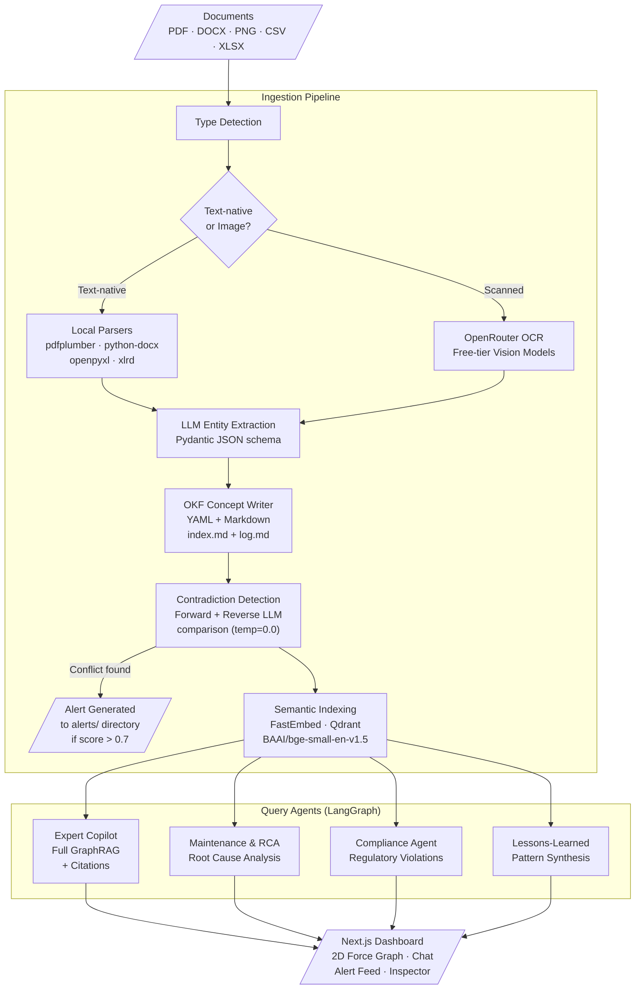

# Vigil

**Industrial Knowledge Intelligence Platform -- ET AI Hackathon PS 8**

Industrial organizations manage thousands of fragmented documents: equipment datasheets, maintenance logs, P&IDs, regulatory codes (OSHA, EPA), scanned forms, and operational procedures. When an engineer updates a procedure or a new regulation arrives, no existing tool proactively checks whether the change introduces a safety or compliance conflict with the rest of the knowledge base. Vigil detects those contradictions the moment a document enters the system, not days later during an audit or after an incident.

---

## Core Differentiator: Proactive Contradiction Detection

Every knowledge management system can search and answer questions reactively. Vigil goes further: when a new document is ingested, it performs a **double-sided contradiction check** against all linked existing concepts in the knowledge graph.

- **Forward check**: The newly ingested concept is compared against every concept it explicitly references.
- **Reverse check**: All existing concepts that reference the new concept are also pulled in and compared.

If a contradiction exceeds a 0.7 confidence threshold, Vigil automatically generates a compliance alert in the `alerts/` directory, linking both conflicting sources. The alert appears immediately on the dashboard with a severity rating and a side-by-side comparison view.

This means an operator updating a maintenance bypass procedure that violates an OSHA pressure limit is stopped at ingestion time, not during an inspection.

## Document Parsing Performance

| File Type | Method Used | Approach | Notes |
|:---|:---|:---|:---|
| PDF (native/text) | PyMuPDF (primary), pdfplumber (fallback) | Direct text-layer extraction, no LLM call | Benchmarked 50-94% faster than pdfplumber alone across our test corpus |
| PDF (scanned/image) | OpenRouter vision model | AI-powered OCR with layout understanding | Handles messy real-world scans (tested on a 1995 handwritten survey form with full accuracy) |
| DOCX | python-docx | Direct XML structure parsing, no LLM call | Preserves headings and paragraph structure for citation accuracy |
| XLSX / XLS | openpyxl / xlrd | Direct spreadsheet structure parsing, no LLM call | Automatically handles legacy .xls files misencoded as modern .xlsx |
| CSV | Python csv module | Direct structured parsing, no LLM call | Zero-dependency, deterministic |

These benchmark times are real, measured results from running the test script [test_parsing.py](apps/backend/scripts/test_parsing.py) against our own local [test_documents/](test_documents/) corpus, rather than synthetic or third-party benchmarks.

| Document | Previous (pdfplumber) | Current (PyMuPDF) | Improvement |
|:---|:---:|:---:|:---:|
| 29 CFR 1910.119 (OSHA regulation, 316KB) | 1.61s | 0.26s | 83.8% faster |
| P&ID Reference Manual (7MB, largest test doc) | 3.44s | 0.20s | 94.2% faster |
| Piping & Instrumentation Diagrams | 0.80s | 0.15s | 81.2% faster |
| OSHA 1910.119 (alternate source) | 1.50s | 0.17s | 88.6% faster |
| Sample document (100KB) | 0.04s | 0.02s | 50.0% faster |

---

## Architecture Overview

Full data flow from document ingestion through multi-agent query routing to the frontend dashboard. See [docs/architecture.md](docs/architecture.md) for a detailed breakdown of each step.



---

## Tech Stack

### Backend (Python)
| Layer | Technology | Details |
|:---|:---|:---|
| Agent orchestration | `langgraph` | StateGraph with conditional routing |
| LLM gateway | `openai` (OpenRouter) | Falls back to OpenRouter when Groq/Portkey keys are placeholders (as currently configured) |
| Primary model | `meta-llama/llama-3.3-70b-instruct` | Via OpenRouter free tier |
| Vision/OCR | `openrouter` API | Free-tier vision models for scanned documents |
| Local parsers | PyMuPDF (primary), `pdfplumber` (fallback), `python-docx`, `openpyxl`, `xlrd` | For text-native PDFs, DOCX, and spreadsheets |
| Knowledge format | Open Knowledge Format (OKF) | Custom Markdown + YAML frontmatter schema for concept storage, cross-linked via relative markdown links, with `index.md` and `log.md` per directory. Full schema in [AGENTS.md](AGENTS.md) and [.agents/skills/okf_writer/SKILL.md](.agents/skills/okf_writer/SKILL.md) |
| Vector storage | `qdrant-client` | Falls back to local file-based storage (`vigil_qdrant.db`) when no server URL configured |
| Embeddings | `fastembed` | `BAAI/bge-small-en-v1.5` |
| Reranking | `flashrank` | For search result reordering |
| Evaluation | `ragas` | Faithfulness, context precision/recall, answer relevancy |
| API server | `fastapi` + `uvicorn` | REST API on port 8000 |
| Observability | `langsmith` | Tracing (when API key configured) |

### Frontend (Next.js)
| Layer | Technology | Details |
|:---|:---|:---|
| Framework | Next.js 16 | App Router |
| Styling | Tailwind CSS 4 | Warm editorial visual identity inspired by Anthropic's design language (ivory surfaces, clay accent, serif/sans pairing). See [.agents/skills/frontend_design/SKILL.md](.agents/skills/frontend_design/SKILL.md) for the full color palette and typography specification. |
| Animations | `framer-motion` | Tab transitions, modal enter/exit |
| Graph | `react-force-graph-2d` | Obsidian-style 2D force layout |
| Icons | `lucide-react` | |

---

## Setup

### Prerequisites
- Python 3.11+ (managed via `uv`)
- Node.js 20+
- An OpenRouter API key (free tier works)

### 1. Clone and set environment variables

```bash
git clone https://github.com/puranikyashaswin/Vigil.git
cd vigil
cp .env.example .env
```

Edit `.env` with your keys:

```env
# Required: OpenRouter (free tier works)
OPENROUTER_API_KEY=sk-or-v1-...

# Optional: Groq/Portkey (if configured, used as primary; otherwise falls back to OpenRouter)
PORTKEY_API_KEY=your_portkey_api_key_here
GROQ_API_KEY=your_groq_api_key_here

# Optional: Qdrant Cloud (if not configured, uses local file-based storage)
QDRANT_URL=your_qdrant_url_here
QDRANT_API_KEY=your_qdrant_api_key_here

# Optional: LangSmith tracing
LANGSMITH_API_KEY=your_langsmith_api_key_here
LANGSMITH_TRACING=true
LANGSMITH_PROJECT=vigil
```

**Important**: With the default placeholder `GROQ_API_KEY` and `PORTKEY_API_KEY`, all LLM calls automatically route through OpenRouter using `meta-llama/llama-3.3-70b-instruct` (free). No Groq or Portkey account is needed.

### 2. Install Python dependencies

```bash
# Create virtual environment with uv (if not already present)
uv venv
source .venv/bin/activate

# Install dependencies (core packages already listed in the venv)
uv pip install fastapi uvicorn langgraph openai qdrant-client fastembed \
  pydantic python-dotenv pdfplumber python-docx openpyxl xlrd httpx \
  pypdfium2 Pillow flashrank ragas langsmith
```

### 3. Install frontend dependencies

```bash
cd apps/frontend
npm install
```

### 4. Build the knowledge graph and index

Place your source documents in `test_documents/`, then run:

```bash
# Parse documents, extract entities, write OKF files, detect contradictions
python apps/backend/scripts/build_graph.py

# Embed and index all OKF files into Qdrant
python apps/backend/scripts/index_graph.py
```

The pipeline will:
- Parse PDFs, DOCX, PNGs, CSVs, and XLSX files
- Extract entities using the LLM (Pydantic-validated JSON)
- Write OKF Markdown files to the appropriate `knowledge_graph/` subdirectories
- Run contradiction detection against linked concepts
- Index chunks into Qdrant with directory/type metadata

### 5. Start the backend

```bash
python apps/backend/api.py
# or: uvicorn apps.backend.api:api --host 127.0.0.1 --port 8000
```

### 6. Start the frontend

```bash
cd apps/frontend
npm run dev
```

Open `http://localhost:3000`. The dashboard connects to the backend at `http://127.0.0.1:8000`.

### 7. Test via CLI (optional)

```bash
# Single query
python test_agents.py "What does OSHA 1910.119 require?"

# Interactive mode
python test_agents.py
```

---

## RAGAS Evaluation Results

Vigil was evaluated against a 10-question benchmark spanning compliance, RCA, and copilot queries. Full results are in `docs/ragas_results.md` and `docs/ragas_eval_results.csv`.

| Metric | Score |
|:---|---|
| Faithfulness | **0.781** |
| Context Precision | **0.728** |
| Context Recall | **0.900** |
| Answer Relevancy | N/A (Pydantic adapter conflict in RAGAS) |

**Honest framing of low scores**: Three questions scored 0.0 on individual metrics, but not because the system gave wrong answers. In each case, Vigil correctly refused to hallucinate:

1. **Context Recall 0.0 on "Safety procedures for pump P-102"**: Vigil correctly reported that no P-102-specific operating manual existed in the knowledge base. RAGAS penalized this because the ground truth expected confirmation that P-102 falls under general PSM scope -- a gap that closes the moment a P-102 manual is ingested.

2. **Context Precision 0.0 on "Maintenance history from P&ID documents"**: The raw P&ID text wasn't in the database (only title block specs), so Vigil correctly stated it couldn't answer from the P&ID. The retrieved contexts were legitimate maintenance logs instead, which RAGAS flagged as off-target.

3. **Faithfulness 0.0 on "Standard format for P&ID equipment info"**: Vigil correctly answered "Equipment Title Blocks" with a citation. RAGAS scored it 0.0 because the LLM's phrasing structure differed from the raw OKF text, not because the answer was wrong.

**8 out of 10 questions scored 1.0 on context recall**, meaning Vigil consistently retrieves the right documents. The system's safety-first design (refusing to answer when context is insufficient) is architecturally deliberate, not a bug.

---

## Enterprise Scalability Path

Vigil is architected to scale from a prototype to an enterprise-grade production environment without rewriting the core application logic. 

For a comprehensive, step-by-step engineering breakdown of component upgrades, bottleneck metrics, failure timelines, and cloud sizing estimates, refer to the [Production Scaling Guide](file:///Users/yashaswinsharma/Documents/github/vigil/docs/SCALING.md).

### Summary of Scaling Swaps

| Component | Current (Prototype) | Production Upgrade | Primary Bottleneck |
|:---|:---|:---|:---|
| **LLM Inference** | OpenRouter free tier | Dedicated Portkey Gateway + Paid API | Rate limits (10 to 20 req/min) |
| **OCR Processing** | OpenRouter free vision | Cloud document API or local GPU | Processing speed and quotas |
| **Vector Index** | SQLite-backed Qdrant | Clustered Qdrant Cloud deployment | Concurrent query latency |
| **Reverse Scanning** | Brute-force local regex scan | Qdrant metadata filter payload query | Disk I/O bottlenecks |
| **Pipeline Runner** | Sequential CLI script | Asynchronous queue (Celery / Temporal) | Unhandled crash recovery |
| **Storage Layer** | Local flat directories | Versioned Object Storage (S3 / Git) | File system directory limits |

---

## Project Structure

```
vigil/
  AGENTS.md                 # Project constitution (tech stack, rules, conventions)
  .env / .env.example       # Environment variables
  test_agents.py            # CLI test harness for query agents
  apps/
    backend/
      api.py                # FastAPI server (REST endpoints)
      graph.py              # LangGraph multi-agent definition + routing
      parsers.py            # Document type detection, local parsers, OCR
      scripts/
        build_graph.py      # Full ingestion pipeline
        index_graph.py      # Qdrant embedding + indexing
        run_ragas_eval.py   # RAGAS evaluation runner
    frontend/
      src/
        app/
          page.tsx          # Main dashboard page
          layout.tsx        # Root layout
          globals.css       # Tailwind theme + custom styles
        components/
          ForceGraph2D.tsx  # react-force-graph-2d component
  knowledge_graph/          # OKF concept files (git-tracked)
    equipment/
    procedures/
    regulations/
    maintenance/
    alerts/
  docs/
    ragas_results.md        # RAGAS evaluation summary
    ragas_eval_results.csv  # Raw eval scores
  test_documents/           # Source documents for ingestion
```


