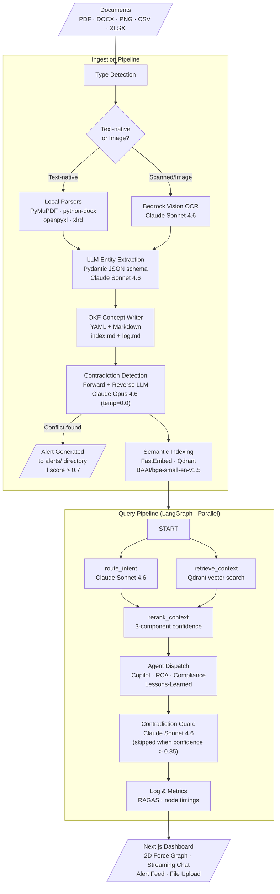

# Vigil

Vigil is an industrial knowledge intelligence platform that detects safety and compliance contradictions in engineering procedures, maintenance logs, and regulatory codes at the moment of ingestion - and answers grounded, cited queries through a multi-agent RAG pipeline powered by Amazon Bedrock.

---

## Architecture Overview

Full data flow from document ingestion through parallel query routing to the streaming frontend dashboard.


```mermaid
flowchart TD
    DOC[/"Documents\nPDF · DOCX · PNG · CSV · XLSX"/]

    subgraph PIPELINE["Ingestion Pipeline"]
        DETECT["Type Detection"]
        PARSER{"Text-native\nor Image?"}
        LOCAL["Local Parsers\nPyMuPDF · python-docx\nopenpyxl · xlrd"]
        OCR["Bedrock Vision OCR\nClaude Sonnet 4.6"]
        EXTRACT["LLM Entity Extraction\nPydantic JSON schema\nClaude Sonnet 4.6"]
        OKF["OKF Concept Writer\nYAML + Markdown\nindex.md + log.md"]
        CHECK["Contradiction Detection\nForward + Reverse LLM\nClaude Opus 4.6 (temp=0.0)"]
        ALERT[/"Alert Generated\nto alerts/ directory\nif score > 0.7"/]
        INDEX["Semantic Indexing\nFastEmbed · Qdrant\nBAAI/bge-small-en-v1.5"]
    end

    subgraph QUERY["Query Pipeline (LangGraph - Parallel)"]
        direction TB
        START2["START"]
        ROUTE["route_intent\nClaude Sonnet 4.6"]
        RETRIEVE["retrieve_context\nQdrant vector search"]
        RERANK["rerank_context\n3-component confidence"]
        AGENT["Agent Dispatch\nCopilot · RCA · Compliance\nLessons-Learned"]
        GUARD["Contradiction Guard\nClaude Sonnet 4.6\n(skipped when confidence > 0.85)"]
        LOG["Log & Metrics\nRAGAS · node timings"]
        START2 --> ROUTE
        START2 --> RETRIEVE
        ROUTE --> RERANK
        RETRIEVE --> RERANK
        RERANK --> AGENT
        AGENT --> GUARD
        GUARD --> LOG
    end

    DASHBOARD[/"Next.js Dashboard\n2D Force Graph · Streaming Chat\nAlert Feed · File Upload"/]

    DOC --> DETECT
    DETECT --> PARSER
    PARSER -- "Text-native" --> LOCAL
    PARSER -- "Scanned/Image" --> OCR
    LOCAL --> EXTRACT
    OCR --> EXTRACT
    EXTRACT --> OKF
    OKF --> CHECK
    CHECK -- "Conflict found" --> ALERT
    CHECK --> INDEX
    INDEX --> QUERY
    LOG --> DASHBOARD
```

---

## Core Differentiator: Proactive Contradiction Detection

Every knowledge management system can search and answer questions reactively. Vigil goes further: when a new document is ingested, it performs a **double-sided contradiction check** against all linked existing concepts in the knowledge graph.

- **Forward check**: The newly ingested concept is compared against every concept it explicitly references.
- **Reverse check**: All existing concepts that reference the new concept are also pulled in and compared.

If a contradiction exceeds a 0.7 confidence threshold, Vigil automatically generates a compliance alert in the `alerts/` directory, linking both conflicting sources with severity and side-by-side comparison. An operator updating a maintenance bypass procedure that violates an OSHA pressure limit is stopped at ingestion time, not during an inspection.

---

## Parallel Query Pipeline

The query pipeline uses a **fan-out/fan-in** LangGraph topology. `route_intent` (LLM classification) and `retrieve_context` (Qdrant vector search) run concurrently from `START`, saving ~300–400ms per query compared to sequential execution.

```
START ──┬── route_intent ─────┐
        └── retrieve_context ──┤
                               ▼
                      rerank_context → agent dispatch → guard → log → END
```

### 3-Component Confidence Model

After retrieval, a mathematically grounded confidence score is computed:

```
relevance  = harmonic_mean(top_k_scores)         # penalizes weak outliers
consensus  = sigmoid(fraction_of_scores > 0.55)  # smooth agreement signal
coverage   = unique_source_files / total_hits    # source diversity

confidence = 0.5 × relevance + 0.3 × consensus + 0.2 × coverage
```

The full breakdown (`relevance`, `consensus`, `coverage`, `formula`) is returned in every API response under `metadata.confidence`.

### Smart Guard Skipping

The contradiction guard LLM call is skipped (saving ~800ms) when any of these conditions are met:

| Condition | Skip Reason in Trace |
|:---|:---|
| No contexts retrieved | `no_contexts` |
| Response is a safety refusal | `refusal_response` |
| `confidence.score > 0.85` AND `consensus > 0.9` | `high_confidence` |
| Response < 50 words | `short_response` |

---

## LLM Routing (Amazon Bedrock)

All LLM calls route through a unified `call_llm(task, ...)` gateway in `shared_utils.py`. Model selection is automatic based on task:

| Task | Model | Reason |
|:---|:---|:---|
| `contradiction` | `claude-opus-4-6-v1` | Highest reasoning for safety-critical detection |
| `topology` | `claude-opus-4-6-v1` | Complex P&ID structural analysis |
| `route_intent` | `claude-sonnet-4-6` | Fast intent classification (max 20 tokens) |
| `extraction` | `claude-sonnet-4-6` | Entity extraction from documents |
| `generation` | `claude-sonnet-4-6` | RAG response generation |
| `ocr` | `claude-sonnet-4-6` | Vision OCR for scanned documents |
| `contradiction_guard` | `claude-sonnet-4-6` | Post-generation safety check |

Cross-region inference profile IDs used:
- Opus: `us.anthropic.claude-opus-4-6-v1`
- Sonnet: `us.anthropic.claude-sonnet-4-6`

**Fallback**: If AWS credentials are not configured, the system automatically falls back to OpenRouter (`meta-llama/llama-3.3-70b-instruct`).

---

## Streaming Chat

Queries to `/api/query/stream` return Server-Sent Events (SSE). Tokens appear on the frontend as Claude generates them - perceived latency drops from a ~20-second blank wait to text appearing in ~2 seconds.

```
event: token  → {"token": "The ", "done": false}
event: token  → {"token": "pressure ", "done": false}
...
event: done   → {"metadata": {"confidence": {...}, "node_metrics": {...}}}
```

---

## Interactive Graph Features

### Node Search & Filter

The graph panel includes a search bar that filters nodes in real-time by label, ID, or type. Matching nodes remain fully visible while non-matching nodes fade to 15% opacity, making it easy to locate specific equipment, procedures, or regulations in large knowledge graphs.

### Bidirectional Chat ↔ Graph Linking

- **Graph → Chat**: Clicking a node and pressing "Ask Vigil About This Asset" in the Inspector Panel automatically sends a contextual query about that node's status, compliance risks, and maintenance history.
- **Chat → Graph**: When the AI responds with citations, the cited source nodes glow orange (primary) and their neighbors glow blue (secondary) on the graph via animated impact ripple.

### Real-Time WebSocket Updates

The backend exposes a WebSocket endpoint at `/ws/updates`. When documents are ingested via the upload pipeline, a `graph_updated` event is broadcast to all connected clients. The frontend:

1. Automatically re-fetches the graph and alerts data
2. Highlights newly added nodes with an orange glow for 5 seconds
3. Reconnects automatically if the connection drops (5-second retry)

This eliminates the need to manually refresh after ingesting new documents.

---

## Real File Upload with Live Pipeline Progress

Uploading documents via `/api/ingest/upload` returns SSE progress events per file:

```
event: file_start    → {"file": "doc.pdf", "index": 0, "total": 2}
event: step          → {"step": 1, "label": "Parsing document...", "status": "running"}
event: step          → {"step": 2, "label": "Extracting entities...", "status": "complete"}
event: contradiction → {"detected": true, "severity": "high", ...}
event: file_complete → {"file": "doc.pdf", "entities_count": 4}
event: done          → {"total_files": 2, "new_node_ids": ["equipment/valve-v-202.md", ...]}
```

After upload completes, the knowledge graph refreshes automatically and newly added nodes glow green for 5 seconds.

---

## Empirical Evaluation & Performance Benchmarks

### 1. Proactive Contradiction Detection Sweep (n=42 pairs)

Evaluated against a dataset of 42 concept pairs (21 contradictory, 21 clean). Hard pairs (implicit, temporal, multi-hop conflicts) were hand-written to reduce construction bias.

| Threshold | TP | FP | TN | FN | Precision | Recall | F1-Score |
|:---:|:---:|:---:|:---:|:---:|:---:|:---:|:---:|
| **0.5** | 15 | 2 | 19 | 6 | 0.8824 | 0.7143 | 0.7895 |
| **0.6** | 15 | 2 | 19 | 6 | 0.8824 | 0.7143 | 0.7895 |
| **0.7** | 15 | 2 | 19 | 6 | 0.8824 | 0.7143 | **0.7895** |
| **0.8** | 15 | 2 | 19 | 6 | 0.8824 | 0.7143 | 0.7895 |

Confidence scores are bimodal - threshold choice in 0.5–0.8 has no effect:
- **Contradictory cohort**: avg **0.6995** (median **0.9500**)
- **Clean control cohort**: avg **0.0919** (median **0.0000**)

Default threshold: **0.7** (robust safety margin). See [docs/contradiction_benchmark_results.md](docs/contradiction_benchmark_results.md).

### 2. QA RAG Performance (40-Question Split Benchmark)

| Metric | Score | Notes |
|:---|:---:|:---|
| Faithfulness (in-scope, n=30) | **0.8112** | Factual grounding of responses |
| Answer Relevancy (in-scope, n=30) | **0.8307** | Alignment with query intent |
| Context Precision (in-scope, n=30) | **0.7197** | Relevance of retrieved directories |
| Context Recall (in-scope, n=30) | **0.7167** | Retrieval rate of ground-truth facts |
| Correct-Refusal Rate (out-of-scope, n=10) | **1.0000** | 10/10 correct safety refusals |
| False-Refusal Rate (in-scope, n=30) | **0.0667** | 2/30 human-verified false refusals |

Full scores: [docs/ragas_results.md](docs/ragas_results.md) and [docs/ragas_eval_results.csv](docs/ragas_eval_results.csv).

### 3. Retrieval Ablation Study (n=30 questions, zero API cost)

| Method | Hit@5 | MRR | Difference |
|:---|:---:|:---:|:---:|
| Without Reranking | 0.9667 | 0.8944 | Baseline |
| With FlashRank | 1.0000 | 0.9333 | MRR +0.0389 |

Full scores: [docs/retrieval_ablation_results.md](docs/retrieval_ablation_results.md).

---

## Known Limitations & Engineering Trade-offs

1. **False Negative Taxonomy (n=6 missed contradictions)**:
   - `implicit_operational` (shift/temporal logic): 3/6 pairs missed (IDs 25, 35, 37)
   - `multi_hop` (cross-document chaining): 3/3 pairs missed (IDs 23, 39, 41)
   - Every missed pair scored exactly **0.00** (non-detection, not miscalibration - no threshold adjustment can recover them).

2. **Unit Mismatch False Positives**: The detector treats PSI vs MPa and °C vs °F as contradiction signals instead of converting. Clean pairs 32 and 34 were falsely flagged at 0.95 and 0.98 confidence.

3. **AI-Assisted Benchmark Bias**: The 42 pairs were constructed with AI assistance. Hard pairs were hand-written to mitigate this; independent external evaluation remains future work.

4. **Small Out-of-Scope Cohort**: The 100% correct-refusal rate is on n=10 queries - a wide statistical confidence interval. It shows the guardrails work on this set, not a proven general rate.

5. **Reranking Disabled on Free-Tier Render**: FlashRank is disabled on the 512MB Render instance to prevent OOM crashes. Cost of this trade-off: MRR drops from 0.9333 → 0.8944, Hit@5 drops from 1.0 → 0.9667.

---

## Document Parsing Performance

| File Type | Method | Notes |
|:---|:---|:---|
| PDF (text-native) | PyMuPDF (primary), pdfplumber (fallback) | No LLM call; 80–94% faster than pdfplumber alone |
| PDF (scanned/image) | Claude Sonnet 4.6 vision (Bedrock) | AI-powered OCR with layout understanding |
| DOCX | python-docx | Preserves headings and paragraph structure |
| XLSX / XLS | openpyxl / xlrd | Handles legacy .xls files misencoded as .xlsx |
| CSV | Python csv module | Zero-dependency, deterministic |

Measured on [test_documents/](test_documents/) corpus via [scripts/test_parsing.py](apps/backend/scripts/test_parsing.py):

| Document | pdfplumber | PyMuPDF | Improvement |
|:---|:---:|:---:|:---:|
| 29 CFR 1910.119 OSHA (316KB) | 1.61s | 0.26s | 83.8% faster |
| P&ID Reference Manual (7MB) | 3.44s | 0.20s | 94.2% faster |
| Piping & Instrumentation Diagrams | 0.80s | 0.15s | 81.2% faster |
| OSHA 1910.119 alternate | 1.50s | 0.17s | 88.6% faster |
| Sample 100KB | 0.04s | 0.02s | 50.0% faster |

---

## Tech Stack

### Backend (Python)

| Layer | Technology | Details |
|:---|:---|:---|
| Agent orchestration | `langgraph` | Parallel fan-out StateGraph: `START → {route_intent ∥ retrieve_context} → rerank_context → agent → guard → log` |
| LLM gateway | `anthropic[bedrock]` | Unified `call_llm(task)` routes to Opus 4.6 or Sonnet 4.6 automatically |
| Primary models | Claude Opus 4.6, Claude Sonnet 4.6 | Via Amazon Bedrock cross-region inference profiles |
| Vision/OCR | Claude Sonnet 4.6 vision (Bedrock) | For scanned documents and P&ID images |
| Fallback LLM | OpenRouter `meta-llama/llama-3.3-70b-instruct` | Used when AWS credentials not configured |
| Local parsers | PyMuPDF, pdfplumber, python-docx, openpyxl, xlrd | Text-native PDFs, DOCX, spreadsheets |
| Knowledge format | Open Knowledge Format (OKF) | YAML frontmatter + Markdown; cross-linked via relative paths; `index.md` + `log.md` per directory. Schema in [AGENTS.md](AGENTS.md) |
| Vector storage | `qdrant-client` | Local SQLite (`vigil_qdrant.db`) or Qdrant Cloud |
| Embeddings | `fastembed` | `BAAI/bge-small-en-v1.5` - shared singleton, no reload on re-index |
| Reranking | `flashrank` | `ms-marco-MiniLM-L-12-v2`; disabled on 512MB instances |
| Confidence model | Custom 3-component formula | `0.5×relevance + 0.3×consensus + 0.2×coverage` |
| Streaming | FastAPI SSE | `/api/query/stream` and `/api/ingest/upload` |
| Evaluation | `ragas` | Faithfulness, context precision/recall, answer relevancy |
| API server | `fastapi` + `uvicorn` | REST + SSE on port 8000 |
| Observability | `langsmith` | Per-node timing, token usage, model used, confidence breakdown |

### Frontend (Next.js)

| Layer | Technology | Details |
|:---|:---|:---|
| Framework | Next.js 16 | App Router |
| Styling | Tailwind CSS 4 | Ivory surfaces, clay accent, serif/sans pairing |
| Animations | `framer-motion` | Tab transitions, modal enter/exit |
| Graph | `react-force-graph-2d` | Canvas-rendered 2D force layout; hover tooltips; glow on new nodes; **live search/filter** |
| Real-time | WebSocket (`/ws/updates`) | Graph auto-refreshes when new documents are ingested - no manual reload needed |
| Bidirectional linking | Inspector → Chat | "Ask Vigil About This Asset" button sends contextual query from any selected node |
| Markdown | Custom renderer | Tables, blockquotes, compliance matrices, RCA tables - all rendered |
| Streaming | Fetch ReadableStream | Chat tokens stream token-by-token; upload progress via SSE |
| File Upload | HTML5 drag-and-drop | Multi-file; 50MB limit; real-time pipeline progress |
| Icons | `lucide-react` | |

---

## Setup

### Prerequisites

- Python 3.11+ (managed via `uv`)
- Node.js 20+
- AWS credentials with Bedrock access (us-east-1)

### 1. Clone and set environment variables

```bash
git clone https://github.com/puranikyashaswin/Vigil.git
cd vigil
cp .env.example .env
```

Edit `.env`:

```env
# Required: Amazon Bedrock (us-east-1, Claude Opus/Sonnet access)
AWS_ACCESS_KEY_ID=AKIA...
AWS_SECRET_ACCESS_KEY=...
AWS_REGION=us-east-1

# Optional: Qdrant Cloud (falls back to local vigil_qdrant.db if not set)
QDRANT_URL=https://your-cluster.qdrant.io
QDRANT_API_KEY=your_qdrant_api_key

# Optional: fallback LLM if AWS not configured
OPENROUTER_API_KEY=sk-or-v1-...

# Optional: LangSmith tracing
LANGSMITH_API_KEY=your_langsmith_key
LANGSMITH_TRACING=true
LANGSMITH_PROJECT=vigil
```

### 2. Install Python dependencies

```bash
uv venv
source .venv/bin/activate
uv pip install -r requirements.txt
```

### 3. Install frontend dependencies

```bash
cd apps/frontend
npm install
```

### 4. Build the knowledge graph and index

Place source documents in `test_documents/`. Then:

```bash
# Parse documents, extract entities, write OKF files, detect contradictions
python apps/backend/scripts/build_graph.py

# Embed and index all OKF files into Qdrant
python apps/backend/scripts/index_graph.py
```

For P&ID diagram topology extraction:

```bash
python pid_topology_extractor.py --input test_documents/your_diagram.png
```

### 5. Start the backend

```bash
python apps/backend/api.py
```

The server auto-indexes the knowledge graph in a background thread on first start so port binding is immediate.

### 6. Start the frontend

```bash
cd apps/frontend
npm run dev
```

Open `http://localhost:3000`.

### 7. Test via CLI (optional)

```bash
# Single query
python test_agents.py "What does OSHA 1910.119 require?"

# Interactive mode
python test_agents.py
```

---

## Cloud Deployment (Render)

Vigil is deployed on Render's free tier. Key configuration:

### Environment Variables (Render)

Set these in **Render → Environment**:

| Variable | Value |
|:---|:---|
| `AWS_ACCESS_KEY_ID` | Your AWS key |
| `AWS_SECRET_ACCESS_KEY` | Your AWS secret |
| `AWS_REGION` | `us-east-1` |
| `QDRANT_URL` | Qdrant Cloud cluster URL |
| `QDRANT_API_KEY` | Qdrant Cloud API key |

### Keep-Alive (Free Tier)

Render free-tier instances sleep after 15 minutes of inactivity. Set up a free UptimeRobot monitor:
- **URL**: your Render backend URL + `/api/health`
- **Interval**: every 5 minutes

This prevents cold-start delays during demos.

### Performance on Free Tier (512MB RAM)

- FlashRank reranking is **disabled** (`ENABLE_RERANKING` not set) to stay within 512MB
- Embedding model loads once as a global singleton - no reload on re-index
- Auto-indexing runs in a background daemon thread - port binds in < 2 seconds

### Administrative Endpoints

| Endpoint | Purpose |
|:---|:---|
| `GET /api/health` | Health check (used by UptimeRobot) |
| `GET /api/admin/index-all` | Re-embed and upsert all OKF files into Qdrant |
| `GET /api/graph` | Knowledge graph nodes and edges (cached) |
| `POST /api/ingest/upload` | Upload documents with live SSE progress |
| `POST /api/query/stream` | Streaming chat query (SSE) |
| `WS /ws/updates` | WebSocket - broadcasts `graph_updated` events after ingestion |

---

## Running the Evaluation Suites

All source documents in `test_documents/` are git-tracked for exact reproducibility.

```bash
# RAGAS QA evaluation (40 questions - 30 in-scope, 10 out-of-scope)
python apps/backend/scripts/run_ragas_eval.py

# Contradiction detection threshold sweep (42 labeled pairs)
python apps/backend/scripts/run_contradiction_benchmark.py

# Retrieval ablation - Hit@5 and MRR with/without FlashRank (zero API cost)
python apps/backend/scripts/run_retrieval_ablation.py
```

---

## Enterprise Scalability Path

Vigil is architected to scale without rewriting core logic. See [docs/SCALING.md](docs/SCALING.md) for full breakdown.

| Component | Current | Production Upgrade | Bottleneck |
|:---|:---|:---|:---|
| LLM Inference | Amazon Bedrock (on-demand) | Bedrock Provisioned Throughput | Rate limits |
| OCR Processing | Claude Sonnet 4.6 vision | Batch inference / async queue | Processing quotas |
| Vector Index | SQLite-backed Qdrant | Qdrant Cloud clustered | Concurrent query latency |
| Reverse Scanning | Brute-force local scan | Qdrant metadata filter index | Disk I/O |
| Pipeline Runner | Sync background thread | Celery / Temporal async queue | Crash recovery |
| Storage Layer | Local flat directories | Versioned Object Storage (S3) | Directory limits |

---

## Project Structure

```
vigil/
  AGENTS.md                    # Project constitution (conventions, OKF schema)
  README.md                    # This file
  requirements.txt             # Python dependencies (pinned)
  .env / .env.example          # Environment variables
  test_agents.py               # CLI test harness for query agents
  pid_topology_extractor.py    # P&ID vision topology extractor
  dump_static_json.py          # Static JSON exporter for demo/Vercel mode
  apps/
    backend/
      api.py                   # FastAPI server - REST + SSE endpoints
      graph.py                 # LangGraph parallel fan-out pipeline
      nodes.py                 # Agent node functions (Copilot/RCA/Compliance/Lessons)
      state.py                 # AgentState + merge_metadata reducer
      retrieval.py             # Vector search + 3-component confidence model
      shared_utils.py          # Unified LLM gateway - call_llm(), call_llm_vision()
      parsers.py               # Document type detection + local parsers + Bedrock OCR
      admin_utils.py           # Qdrant indexing helper
      scripts/
        build_graph.py         # Full ingestion pipeline
        index_graph.py         # Qdrant embedding + indexing
        contradiction.py       # Contradiction detection (uses call_llm)
        okf_utils.py           # OKF file writing utilities
        run_ragas_eval.py      # RAGAS evaluation runner
        run_contradiction_benchmark.py
        run_retrieval_ablation.py
    frontend/
      src/
        app/
          page.tsx             # Main dashboard - streaming chat, upload, graph
          layout.tsx           # Root layout
          globals.css          # Tailwind theme + custom styles
        components/
          ForceGraph2D.tsx      # react-force-graph-2d - hover tooltips, glow
          ChatHistoryOverlay.tsx# Streaming chat UI - full markdown rendering
          DocumentSelector.tsx  # Drag-and-drop file upload zone
          PipelineVisualizer.tsx# Real-time SSE pipeline progress
          PipelineStatusOverlay.tsx
        utils/
          markdown.ts          # Markdown renderer - tables, blockquotes, lists
  knowledge_graph/             # OKF concept files (git-tracked)
    equipment/
    procedures/
    regulations/
    maintenance/
    alerts/
  docs/
    architecture.md
    ragas_results.md
    ragas_eval_results.csv
    contradiction_benchmark_results.md
    contradiction_failure_analysis.md
    retrieval_ablation_results.md
    SCALING.md
  test_documents/              # Source documents corpus (git-tracked)
  logs/
    ragas/                     # RAGAS interaction logs (JSONL)
```
