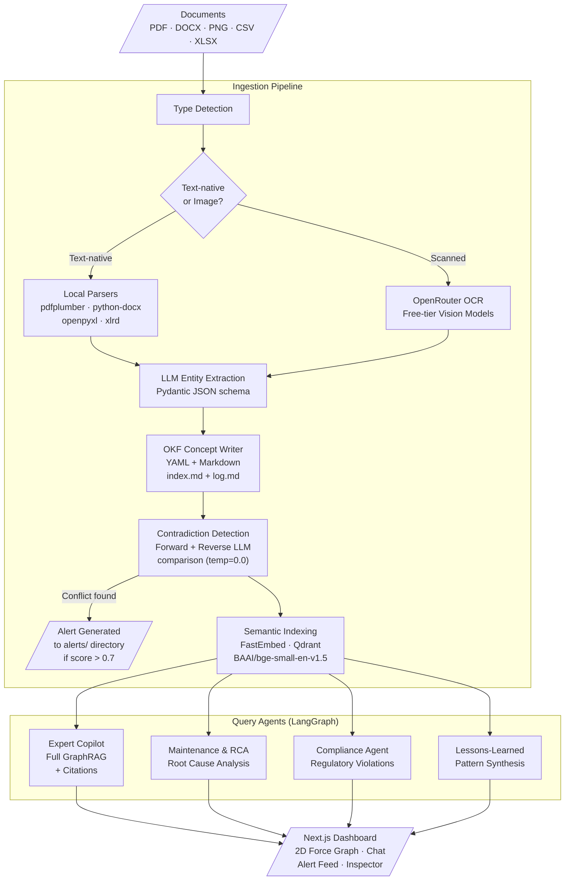

# Vigil Architecture Diagram

The full data flow from document ingestion through multi-agent query routing to the frontend dashboard.

## Node Details

| Step | Description |
|:---|:---|
| Type Detection | Examines file extension and MIME type; routes text-native documents to local parsers, scanned images to OpenRouter OCR or the Topology Extractor |
| Local Parsers | `pdfplumber` (text PDFs), `python-docx`, `openpyxl`/`xlrd` (spreadsheets); structured table extraction into Markdown |
| OpenRouter OCR | Free-tier vision models (`nvidia/nemotron-nano-12b-v2-vl:free`) with automatic fallback chain. P&ID images go through the `pid_topology_extractor.py` to extract connectivity networks (nodes and edges). |
| Entity Extraction | LLM extracts entities into Pydantic-validated JSON; self-repair retry on invalid schema; generic fallback concept on second failure |
| OKF Writer | Writes Markdown files with YAML frontmatter to `knowledge_graph/` subdirectories; appends to `index.md` and `log.md` |
| Contradiction Detection | Forward check (new concept vs. all it links to) + Reverse check (all concepts linking to the new one); LLM comparison at `temp=0.0` |
| Alert Generation | If `confidence_score > 0.7`, writes an alert OKF file to `alerts/` linking both conflicting sources |
| Semantic Indexing | Chunks concept text; embeds via `BAAI/bge-small-en-v1.5`; upserts to Qdrant with `file_path`, `directory`, `text`, `type` metadata |
| Query Agents | LangGraph `StateGraph` with conditional routing; each agent scope-filtered to specific OKF directories; zero-context guard prevents hallucination |
| Dashboard | Next.js with `react-force-graph-2d` (Obsidian-style layout) and a mobile-first Field Technician View featuring bottom nav bars, slide-up drag-to-dismiss chat sheets, and high-contrast sunlight-readable alert feeds |
